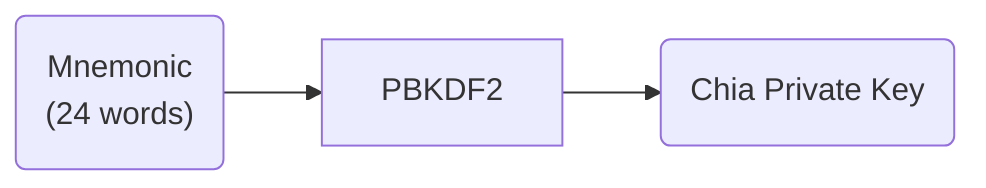
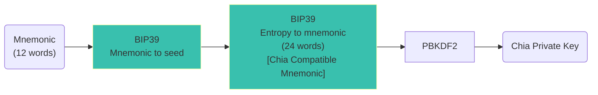
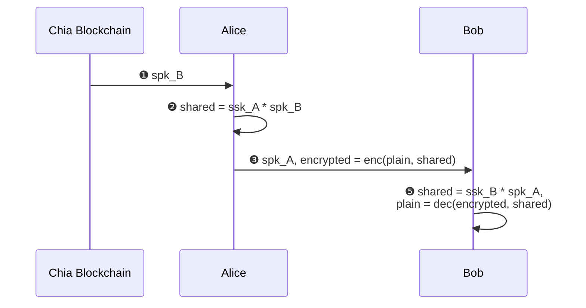

# Chia

## Mnemonic

Pawket's master mnemonic is not compactible with Chia Official Wallet, even we simply allow the length of mnemonic to be 24 words,
because they are indeed different generation process.

For Chia Official Wallet, looks like this:



Indeed, Chia Official Wallet accept any type of text as input other than standard word defined in BIP39, because the whole process is just lots of HASH calculations.

For Pawket, looks like this:



Pawket strictly comply with [BIP39](https://github.com/bitcoin/bips/blob/master/bip-0039.mediawiki) to gain better compatibility.

**Design Consideration**:

- Pawket designs to be chain-agnostic, so universal compatibility is important.
- Comply with BIP39, Pawket implements **Shadow Wallet** with greatest possible compatibility.
- Comply with BIP39, Pawket supports non-english mnemonic words naively.


## Encryption

Pawket utilized the Chia's BLS curve(BLS12-381) and ECDH mechanism to create encryption algorithm, allow user to encrypt message with recipient's address, which only the recipient have ability to decrypt the message, just like the asymmetric encryption did.

With this mechanism, created a good user experience to send message to arbitrary activated address without communication or setup beforehand.

Here are notions:

- **Synthetic Key**: which is unique for each address in your wallet, it represents a synthetic child key of your root key. 
- **Synthetic Public Key**: `spk`, the public part of synthetic key, can be calculate from synthetic private key and it is on-chain for every standard xch transaction.
- **Synthetic Private Key**: `ssk`, the private part of synthetic key, only the private key owner can calculate this key, can be used to decrypt message encrypted by synthetic public key.
- **Activated Address**: address with at least one coin is spent, that is one coin is sent from this address, and the `spk` was recorded on-chain.

Following is the procedure during encryption and decryption.



- ❶ Get Bob's `spk` from Blockchain, which requires activated address.
- ❷ Calculate the shared key according to ECDH.
- ❸ Send the encrypted message and Alice's `spk`.
- ❹ Calculate the shared key by Bob's `ssk` and Alice's `spk` according to ECDH, then decrypted the message.

**Demonstration**

Following is a demo of composite encrypted message:

```text
-------- pawket.xch ---------
Sender Address: xch1ahu8zdwg03qadmk4tan653hxdjy596k6dy63wm0r6etj0g0y5uws4jwntt
Receiver Address: xch16xwqtf2d4jljks8lfpp4xnz8jak7jqjxc07y9tqlgt4grdp5hr4q7vcx3s
Encrypted Message: fd8ccb693c60e1ba3281c0d1a66c8539a537de6365ca685545052842626a5a1c
```

- **Sender Address**: from this address, program can find the `spk_A` from blockchain.
- **Receiver Address**: from this address, program can find the `ssk_B` from wallet.
- **Encrypted Message**: with shared key calculated by ECDH, the message can be decrypted.