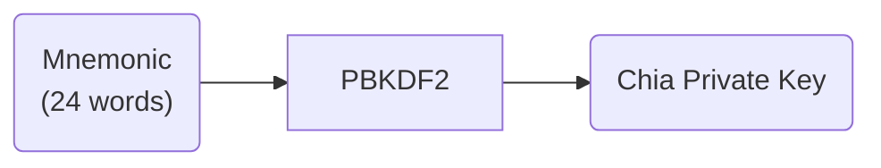
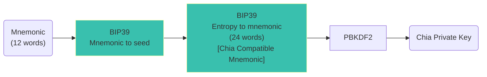

# Chia

## Mnemonic

Pawket's master mnemonic is not compactible with Chia Official Wallet, even we simply allow the length of mnemonic to be 24 words,
because they are indeed different generation process.

For Chia Official Wallet, looks like this:

Indeed, Chia Official Wallet accept any type of text as input other than standard word defined in BIP39, because the whole process is just lots of HASH calculations.

For Pawket, looks like this:

Pawket strictly comply with [BIP39](https://github.com/bitcoin/bips/blob/master/bip-0039.mediawiki) to gain better compatibility.

**Design Consideration**:

- Pawket designs to be chain-agnostic, so universal compatibility is important.
- Comply with BIP39, Pawket implements **Shadow Wallet** with greatest possible compatibility.
- Comply with BIP39, Pawket supports non-english mnemonic words naively.